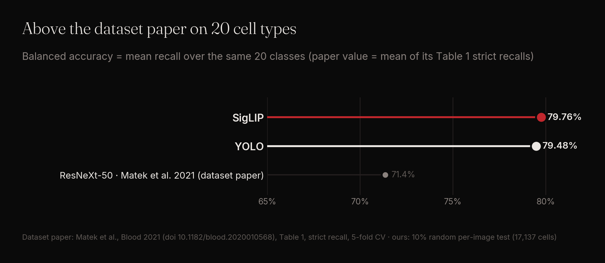
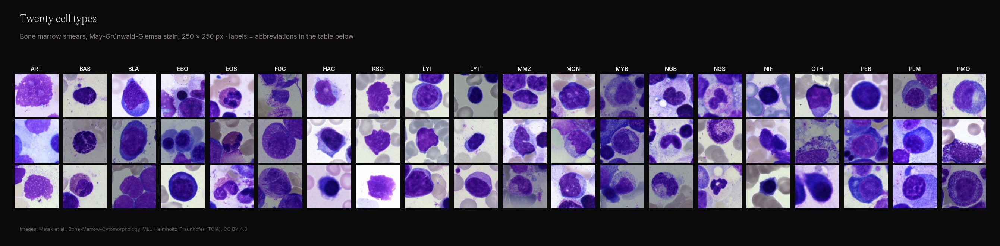
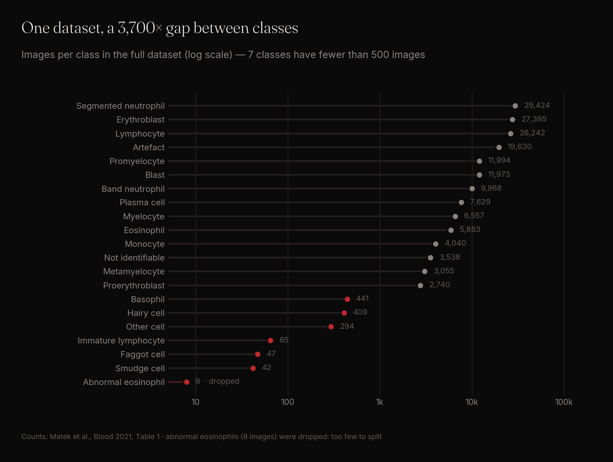
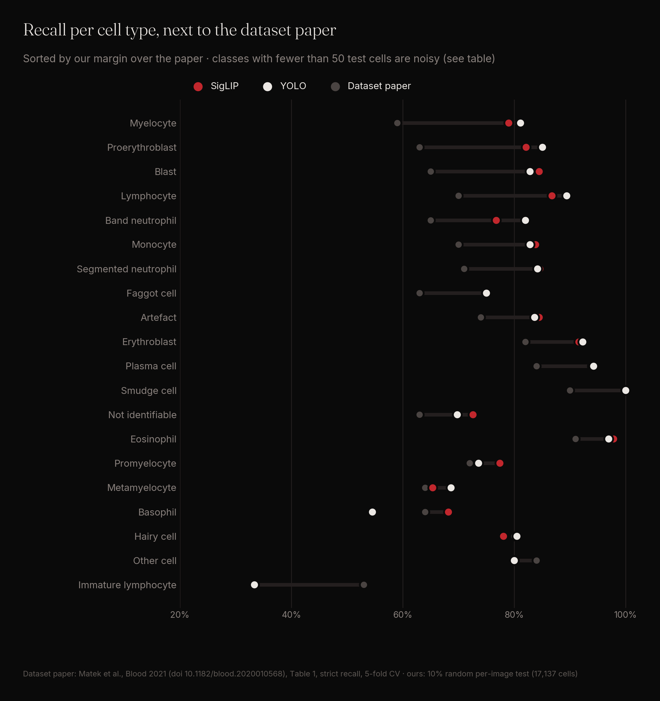
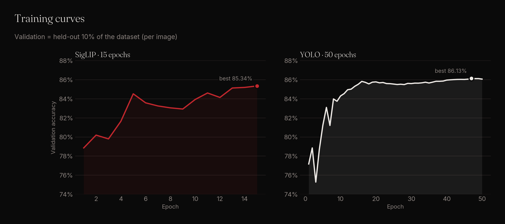
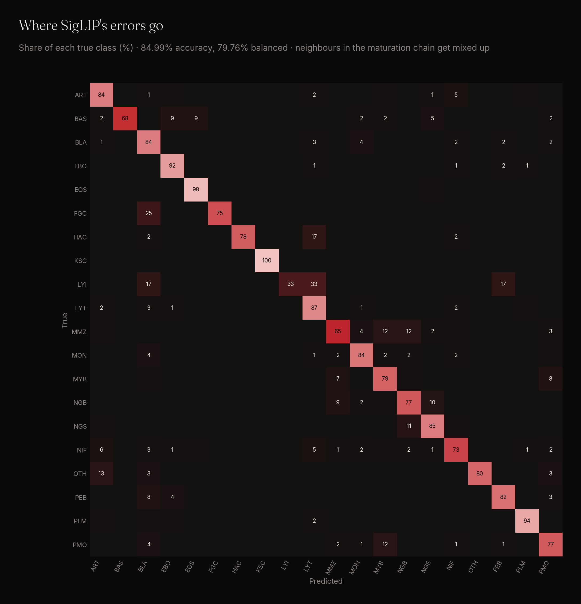

# Bone marrow cell classification — 20 cell types, above the dataset paper and a 2024 follow-up

Two image classifiers, YOLO and SigLIP, were trained with one fixed recipe, **without dataset-specific tuning**, on the largest public bone marrow cytology dataset (Matek et al. 2021, 171,000+ expert-labelled cells) and tested on a held-out set of 17,137 cells.

**Result: 79.76 % (SigLIP) and 79.48 % (YOLO) balanced accuracy over 20 cell types — 8 points above the dataset paper's ResNeXt-50 (71.4 %), while training on 30 % of the images.**

| Model | Balanced accuracy | Accuracy | Macro F1 |
|---|---|---|---|
| **SigLIP** (ours) | **79.76 %** | 84.99 % | 75.93 % |
| **YOLO** (ours) | 79.48 % | **85.30 %** | **76.65 %** |
| ResNeXt-50 (Matek et al. 2021) | 71.4 % | – | – |

Balanced accuracy is the mean recall over the 20 classes. The paper value is the mean of its 20 per-class strict recalls (Table 1), over the same 20 classes.

---

## Try it

| | |
|---|---|
| **Live demo** | [bone-marrow-cells.streamlit.app](https://bone-marrow-cells.streamlit.app) — drop a single-cell image and watch both models predict, side by side |
| **Model weights** | [SigLIP on Hugging Face](https://huggingface.co/ghostsas001/bone-marrow-cells-siglip) · [YOLO on Hugging Face](https://huggingface.co/ghostsas001/bone-marrow-cells-yolo) — ready to download, with usage code |

---

## The dataset

Bone-Marrow-Cytomorphology_MLL_Helmholtz_Fraunhofer: single-cell images (250 × 250 px) cut from bone marrow smears of 945 patients, May-Grünwald-Giemsa stained, labelled by experts of the Munich Leukemia Laboratory into 21 morphological classes.

| Split | Cells | Note |
|---|---|---|
| Train | 51,737 | capped at 4,000 per class |
| Validation | 17,137 | model selection only |
| Test | 17,137 | evaluated once |

<b>The 20 classes and their abbreviations</b>

| Code | Cell type | Test cells | Code | Cell type | Test cells |
|---|---|---|---|---|---|
| ART | Artefact | 1,963 | MMZ | Metamyelocyte | 306 |
| BAS | Basophil | 44 | MON | Monocyte | 402 |
| BLA | Blast | 1,197 | MYB | Myelocyte | 656 |
| EBO | Erythroblast | 2,739 | NGB | Band neutrophil | 998 |
| EOS | Eosinophil | 590 | NGS | Segmented neutrophil | 2,941 |
| FGC | Faggot cell | 4 | NIF | Not identifiable | 354 |
| HAC | Hairy cell | 41 | OTH | Other cell | 30 |
| KSC | Smudge cell | 5 | PEB | Proerythroblast | 274 |
| LYI | Immature lymphocyte | 6 | PLM | Plasma cell | 762 |
| LYT | Lymphocyte | 2,625 | PMO | Promyelocyte | 1,200 |

---

## The problems with this dataset

### 1. Extreme class imbalance

The largest class has 29,424 images, the smallest 8. Seven classes have fewer than 500 images, and three of them end up with only 4 to 6 cells in a 10 % test split — their recall moves in steps of 17 to 25 points per cell.

We dropped abnormal eosinophils (8 images: too few to split into train, validation and test). The dataset paper kept them and reports 20 % recall on that class.

### 2. No patient identifiers

The public release gives no patient or slide id per cell. Any split — ours and the paper's five folds alike — is therefore per image, and cells of the same patient can sit in both training and test. Results on this dataset measure recognition of cell types inside one laboratory's patient cohort, not generalisation to new patients or new laboratories.

### 3. Neighbouring maturation stages

Many classes are consecutive steps of one maturation chain (myelocyte → metamyelocyte → band neutrophil → segmented neutrophil). The boundary between steps is a judgement call, and that is exactly where both models make most of their mistakes.

---

## Compared with the dataset paper

The paper (ResNeXt-50, 250 × 250 px input, classes upsampled to about 25,000 images each, stain augmentation, five-fold cross-validation over the whole dataset) reports class-wise strict recall. Against it, per class:

- Both models are above the paper on **17 of 20 classes**; the better of the two on **18 of 20**.
- The largest gains are on the hard, frequent classes: blasts **84.5 %** vs 65 %, myelocytes **81.1 %** vs 59 %, proerythroblasts **85.0 %** vs 63 %, lymphocytes **89.4 %** vs 70 %.
- The only two classes where both models are below the paper are tiny in our test set: immature lymphocytes (6 cells) and other cells (30 cells).

Not the same protocol: the paper averages five folds over all images, we test once on a 10 % hold-out and train on at most 4,000 images per class. Both are per-image random splits of the same 20 classes.

### Other published results on this dataset

| Method | Protocol | Macro recall (balanced accuracy) | F1 | Source |
|---|---|---|---|---|
| **SigLIP** (ours) | unseen 10 % hold-out, 20 classes | **79.76 %** | macro 0.76 · weighted 0.85 | this repo |
| **YOLO** (ours) | unseen 10 % hold-out, 20 classes | 79.48 % | **macro 0.77 · weighted 0.86** | this repo |
| Xception + region-attention embedding (Tarquino et al. 2024) | unseen 20 % test set, 21 classes | 32 % | macro 0.33 · weighted 0.56 | Table 3 |
| same model, cross-validation | repeated 3-fold CV on the other 80 % | 66 % | macro 0.69 · weighted 0.82 | Table 2 |
| RegNetY-32GF, as tabulated by Tarquino et al. | 5-fold CV | 75 % ¹ | 0.76 ¹ | Table 4 |
| Inception-ResNetV2, as tabulated by Tarquino et al. | hold-out | 59 % ¹ | 0.57 ¹ | Table 4 |
| Siamese network, as tabulated by Tarquino et al. | hold-out | – | **0.81** ¹ | Table 4 |

¹ Averaging (macro or weighted) not stated in the table.

On a test set the model never saw, both of our models are well above the 2024 region-attention model (79.8 % vs 32 % macro recall). The Siamese network listed by Tarquino et al. reports a higher F1 (0.81) than our macro F1 (0.77); its averaging and split are not stated, so we list it without claiming a comparison either way.

A 2025 ensemble study (MobileNetV3 + ResNet18) reports 94 % accuracy on this dataset, but its test table lists about 4,000 test images for every class — including abnormal eosinophils, which have only 8 images in the whole dataset — so its test set must contain augmented copies; we do not compare against it.

---

## Our approach

Both models use one fixed training recipe that we apply unchanged to every dataset. The question here: **how far does that recipe go on bone marrow, with zero dataset-specific tuning?**

| | YOLO | SigLIP |
|---|---|---|
| Training | 50 epochs, 224 px, batch 64 | 15 epochs, lr 5e-5, batch 16 |
| Augmentation | Ultralytics defaults | flips, rotation, sharpness |
| Balancing | none | random oversampling of minority classes |
| Training data | max 4,000 cells per class (51,737 of 171,366) | same |
| Split | stratified 80 / 10 / 10 per image, seed 42 | same |
| Model selection | best epoch on the validation split | same |

Nothing was tuned on the test set. Training ran on a single NVIDIA T4.

---

## Results in detail

The largest confusions are between neighbours: band vs segmented neutrophils (10 % and 11 % each way), metamyelocytes spilling into myelocytes and band neutrophils (12 % each), promyelocytes into myelocytes (12 %). Eosinophils, plasma cells and erythroblasts are recognised above 91 % by both models.

| Class | SigLIP recall | YOLO recall | Paper (strict recall) |
|---|---|---|---|
| Artefact | **84.5 %** | 83.6 % | 74 % |
| Basophil | **68.2 %** | 54.5 % | 64 % |
| Blast | **84.5 %** | 82.8 % | 65 % |
| Erythroblast | 91.6 % | **92.3 %** | 82 % |
| Eosinophil | **97.8 %** | 96.9 % | 91 % |
| Faggot cell | 75.0 % | 75.0 % | 63 % |
| Hairy cell | 78.0 % | **80.5 %** | 80 % |
| Smudge cell | 100 % | 100 % | 90 % |
| Immature lymphocyte | 33.3 % | 33.3 % | **53 %** |
| Lymphocyte | 86.8 % | **89.4 %** | 70 % |
| Metamyelocyte | 65.4 % | **68.6 %** | 64 % |
| Monocyte | **83.8 %** | 82.8 % | 70 % |
| Myelocyte | 79.0 % | **81.1 %** | 59 % |
| Band neutrophil | 76.8 % | **82.0 %** | 65 % |
| Segmented neutrophil | **84.6 %** | 84.2 % | 71 % |
| Not identifiable | **72.6 %** | 69.8 % | 63 % |
| Other cell | 80.0 % | 80.0 % | **84 %** |
| Proerythroblast | 82.1 % | **85.0 %** | 63 % |
| Plasma cell | 94.0 % | **94.2 %** | 84 % |
| Promyelocyte | **77.4 %** | 73.6 % | 72 % |

---

## Take-aways

- **An untuned, fixed recipe works on bone marrow**: 8 points of balanced accuracy above the dataset paper, on 30 % of the images.
- **The gains are on the classes that matter most clinically and are hardest** — blasts, myelocytes, proerythroblasts.
- **Maturation-stage neighbours remain the open problem** for every model on this dataset.

### Limitations

- One training run per model (no seeds / confidence intervals); one 10 % hold-out, not five folds.
- Per-image split: no patient ids, so same-patient cells can appear in training and test (as in the paper).
- Classes with fewer than 50 test cells (basophil, faggot cell, hairy cell, smudge cell, immature lymphocyte, other cell) have very noisy recall.
- Abnormal eosinophils (8 images) excluded.

---

## References

- Matek C., Krappe S., Münzenmayer C., Haferlach T., Marr C. *Highly accurate differentiation of bone marrow cell morphologies using deep neural networks on a large image data set.* Blood 138(20), 2021. [doi:10.1182/blood.2020010568](https://doi.org/10.1182/blood.2020010568)
- Dataset: Bone-Marrow-Cytomorphology_MLL_Helmholtz_Fraunhofer, The Cancer Imaging Archive, [doi:10.7937/TCIA.AXH3-T579](https://doi.org/10.7937/TCIA.AXH3-T579), CC BY 4.0
- Tarquino J. et al. *Engineered feature embeddings meet deep learning: A novel strategy to improve bone marrow cell classification and model transparency.* Journal of Pathology Informatics 15, 2024. [doi:10.1016/j.jpi.2024.100390](https://doi.org/10.1016/j.jpi.2024.100390)
- *Automated bone marrow cell classification using ensemble learning: performance, generalization, and clinical interpretability.* [PMC13272068](https://pmc.ncbi.nlm.nih.gov/articles/PMC13272068/)
- Ultralytics YOLO — [docs.ultralytics.com](https://docs.ultralytics.com)
- SigLIP (Google) — [huggingface.co/google](https://huggingface.co/google)
